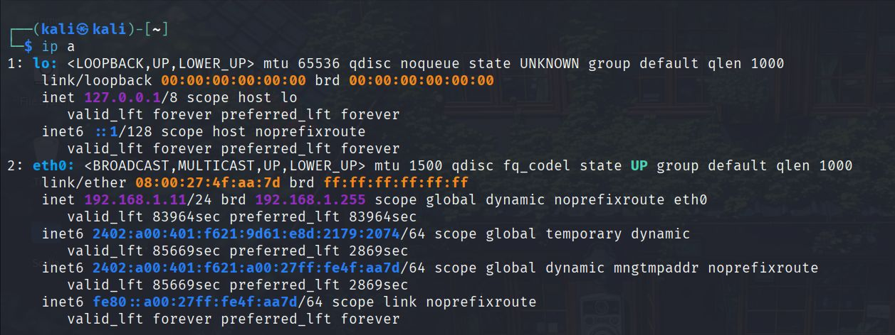
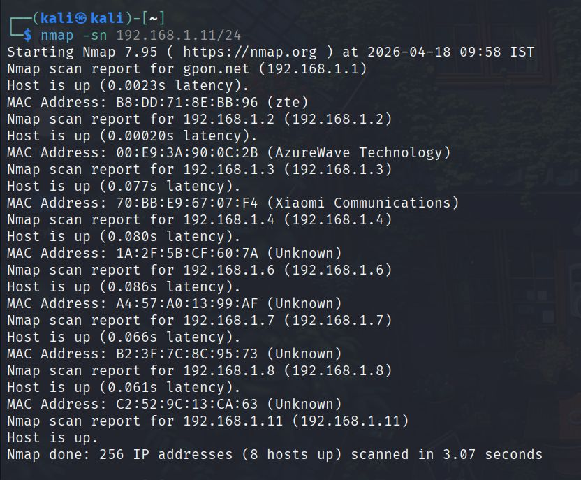
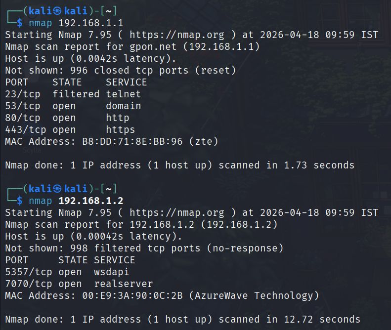
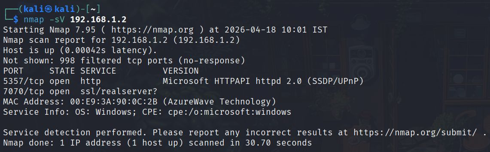
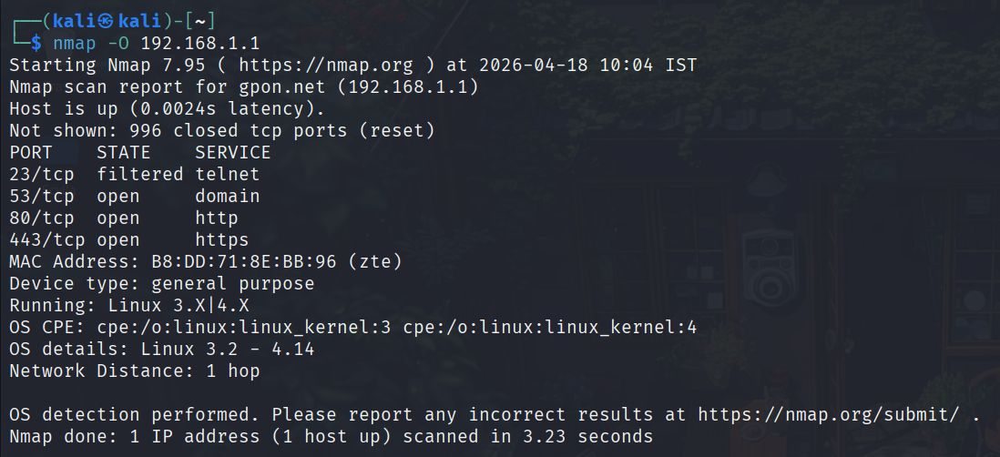
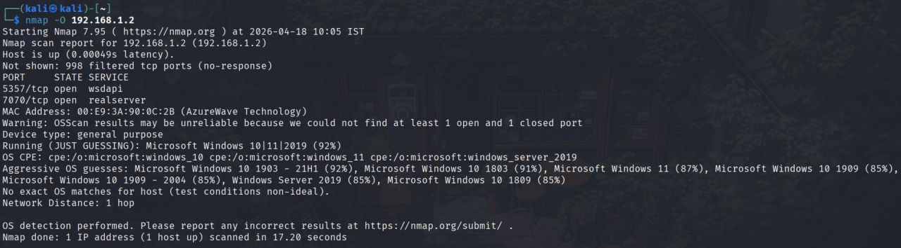
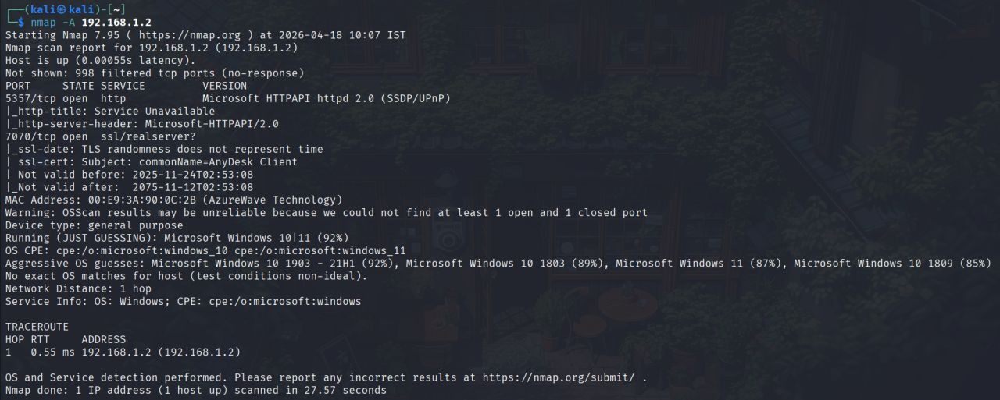
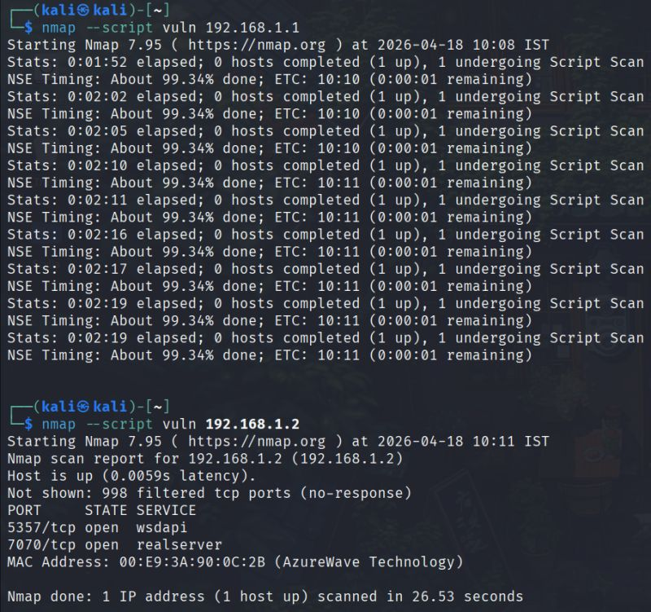
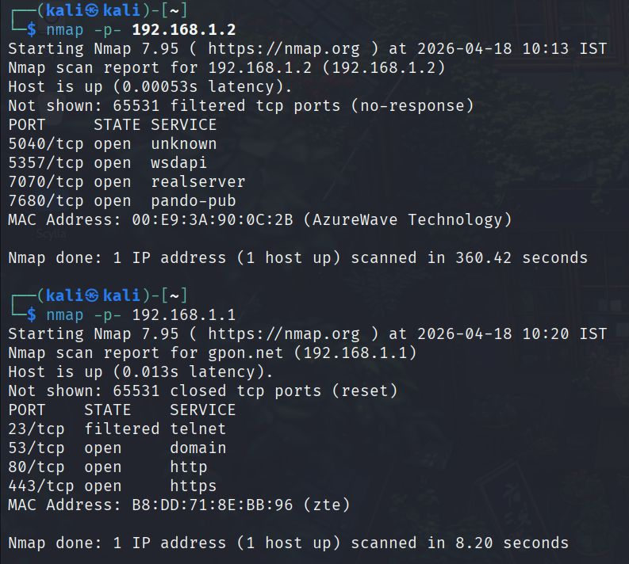

# Project 1: Network Scanning & Information Gathering

## Objective
To perform network scanning using Nmap to discover live hosts, open ports, and running services.

## Tools Used
- Kali Linux
- Nmap

## Commands Used
- nmap -sn
- nmap -sV
- nmap -O
- nmap -A

## Steps Performed
1. Performed ping scan to identify active hosts
2. Scanned for open ports
3. Detected services and OS
4. Used advanced scanning techniques

## Results
- Identified active devices on the network
- Found open ports such as 5357 and 7070
- Detected running services

## Learning Outcome
- Learned network scanning techniques
- Understood how to identify open ports and services

## Conclusion
Network scanning helps in identifying devices and potential vulnerabilities in a network.

## Screenshots

