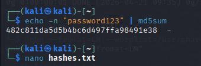
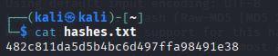
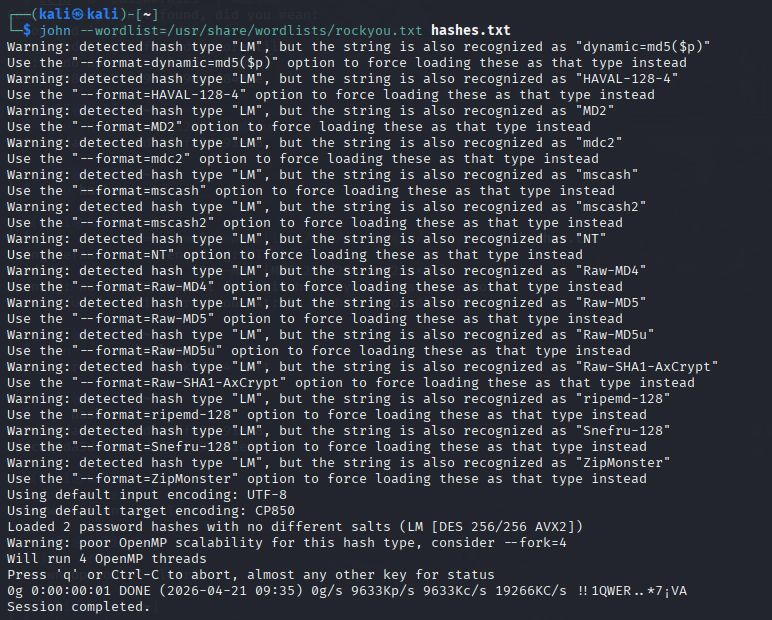
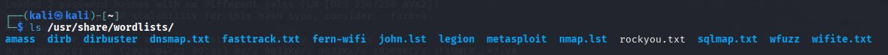
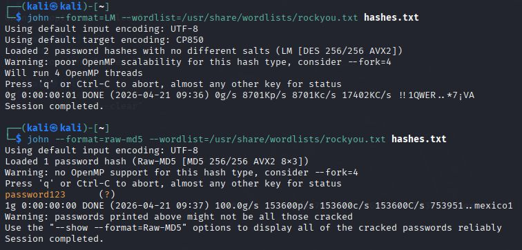
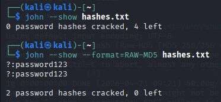

# Project 2: Password Cracking using John the Ripper

## Objective
To understand how weak passwords can be cracked using hash cracking techniques.

## Tools Used
- Kali Linux
- John the Ripper

## Steps Performed
1. Generated or obtained password hashes
2. Saved hashes into a file
3. Used wordlist (rockyou.txt) for cracking
4. Ran John the Ripper with correct format
5. Identified cracked passwords

## Commands Used
- john --wordlist=/usr/share/wordlists/rockyou.txt hashes.txt
- john --show hashes.txt

## Results
- Successfully cracked weak password hashes
- Observed impact of weak password policies

## Learning Outcome
- Learned how password hashing works
- Understood importance of strong passwords
- Learned correct hash format usage

## Screenshots

## Conclusion
Weak passwords can be easily cracked using tools like John the Ripper, highlighting the need for strong password policies.
